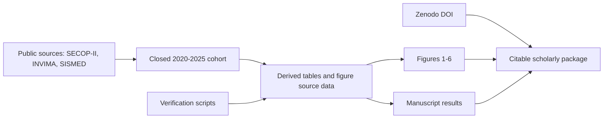

# BigLoI PLOS ONE Reproducibility Package

[](https://doi.org/10.5281/zenodo.19074137)
[](https://github.com/zswamtech/BigLoI-PLOS-ONE-paper)
[](./CITATION.cff)
[](./manuscript/Manuscript_main_submission.md)

**Public pharmaceutical procurement should not be invisible.**

This repository is the article-specific reproducibility package for the BigLoI manuscript:

> **Computational surveillance of Colombian public pharmaceutical procurement using public administrative data: a reproducible analysis of a closed 2020-2025 cohort**

It packages the manuscript, figures, derived data, verification scripts, citation metadata, and availability statements needed to audit the reported results without exposing the broader BigLoI monorepo or any private clinical data.

The scientific claim is intentionally sharp and limited: **open administrative procurement data can be converted into a reproducible surveillance layer for pharmaceutical markets, anomaly prioritization, and public-sector health data governance.**

---

## Why this matters

Pharmaceutical procurement is where public money, institutional capacity, market power, and patient access converge. Yet procurement records are often too fragmented to support fast, reproducible oversight.

This package demonstrates that a national-scale surveillance workflow can be built from public sources:

- SECOP-II public procurement records;
- INVIMA sanitary-registry records;
- SISMED reference-price data;
- reproducible analytical tables and figure source files;
- explicit code and data availability statements.

No patient-level data. No private hospital records. No black-box evidence.

---

## Key reported signals

| Signal | Reported value | Interpretation |
| --- | ---: | --- |
| Closed analytical cohort | **162,271 pharmaceutical contracts** | Complete 2020-2025 analytical window |
| Platform monitoring universe | **272,814 SECOP-II contracts** | Broader BigLoI procurement universe from 2015 onward |
| Z-score alerts | **685 contracts** | Statistical prioritization, not proof of misconduct |
| Alert rate | **0.47%** | Contracts with absolute Z-score >= 1.5 sigma |
| Alert-rate increase | **0.31% in 2021 -> 1.38% in 2025** | Rising heterogeneity requiring dedicated validation |
| Supplier concentration | **Top 3% captured 85.87% of value** | Strong cumulative concentration in public pharmaceutical procurement |
| INVIMA records integrated | **9,838** | Sanitary-registry context |
| SISMED reference prices | **44,038 records** | Contextual reference-price layer |
| RAG documents indexed | **9,336** | Evidence-access layer for semantic retrieval |

---

## What this repository contains

| Path | Purpose |
| --- | --- |
| [`manuscript/`](./manuscript) | Markdown, DOCX, and PDF manuscript files plus cover-letter artifacts. |
| [`figures/`](./figures) | Submission-ready TIFF figures and clean PNG masters. |
| [`data/`](./data) | Minimal derived datasets underlying figures, tables, and metadata. |
| [`code/`](./code) | Minimal scripts, SQL files, verification tools, and environment notes. |
| [`statements/`](./statements) | Data availability, code availability, and release checklist. |
| [`CITATION.cff`](./CITATION.cff) | Citation metadata with Zenodo DOI and author ORCID. |

This is a paper package, not the full production platform. The broader BigLoI source code lives in [`zswamtech/BigLoI-PMV`](https://github.com/zswamtech/BigLoI-PMV).

---

## Reproducibility map



The package is deliberately frozen. The scripts verify and regenerate the paper-specific source-data layer; they are not intended to re-query changing public APIs or reproduce the full BigLoI production system.

---

## Fast verification

From the root of this standalone repository:

```bash
python3 code/scripts/verify_paper_source_data.py
```

Expected success output:

```text
Paper source-data verification passed.
Verified CSV files: 11
Verified text files: 1
```

To regenerate frozen source-data outputs directly:

```bash
python3 code/scripts/generate_paper_source_data.py
python3 code/scripts/verify_paper_source_data.py
```

Environment notes are documented in [`code/environment/README.md`](./code/environment/README.md). The paper-specific generator and verifier use only the Python standard library.

---

## Scientific scope

This repository supports three defensible claims:

1. **Reproducible procurement surveillance is feasible.**
   Public administrative sources can be transformed into auditable analytical outputs.

2. **Statistical prioritization can narrow the review problem.**
   Z-score alerts identify contracts that are atypical within therapeutic categories and should be reviewed, not automatically condemned.

3. **Market-structure signals are visible in open data.**
   Supplier concentration and recurrent buyer-supplier patterns can be measured from public procurement records.

---

## What this does not claim

This package is intentionally cautious. It does **not** claim that:

- a Z-score alert proves corruption, fraud, or unit-price overpricing;
- SECOP-II total-value anomalies replace item-level price auditing;
- SISMED 2017-2019 values are a contemporaneous comparator for every 2020-2025 contract;
- the Sepolia smart-contract module measures real hospital payment performance;
- the illustrative savings scenario is an observed budget impact;
- the BigLoI prototype is deployment-ready for public treasury operations.

The strongest claim here is not hype. It is **traceability**.

---

## Citation

If you use this article-specific package, cite the repository release and DOI:

```bibtex
@misc{soto_bigloi_plos_one_package,
  title        = {Computational surveillance of Colombian public pharmaceutical procurement using public administrative data: a reproducible analysis of a closed 2020-2025 cohort},
  author       = {Soto, Andres},
  year         = {2026},
  doi          = {10.5281/zenodo.19074137},
  url          = {https://github.com/zswamtech/BigLoI-PLOS-ONE-paper}
}
```

Machine-readable citation metadata is available in [`CITATION.cff`](./CITATION.cff).

---

## Data and code availability

- Data availability statement: [`statements/DATA_AVAILABILITY_STATEMENT.md`](./statements/DATA_AVAILABILITY_STATEMENT.md)
- Code availability statement: [`statements/CODE_AVAILABILITY_STATEMENT.md`](./statements/CODE_AVAILABILITY_STATEMENT.md)
- Zenodo DOI: <https://doi.org/10.5281/zenodo.19074137>
- Public repository: <https://github.com/zswamtech/BigLoI-PLOS-ONE-paper>

---

## License and reuse

This article-specific reproducibility package is released under the license declared in [`CITATION.cff`](./CITATION.cff).

Please preserve attribution, cite the DOI, and distinguish clearly between:

- the frozen paper package in this repository;
- the broader BigLoI PMV platform;
- any downstream analysis, fork, or policy interpretation built from these materials.

---

## Contact

**Andres Soto**<br>
Independent researcher<br>
Bogota, Colombia<br>
ORCID: [0009-0004-8001-5372](https://orcid.org/0009-0004-8001-5372)
