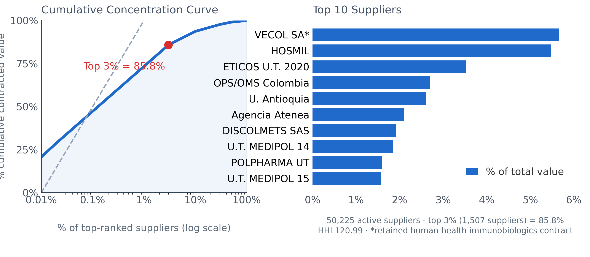

# BigLoI

## Reproducibility package for a closed cohort of Colombian public pharmaceutical procurement, 2020-2025

[](VERSION.md)
[](https://creativecommons.org/licenses/by/4.0/)
[](https://doi.org/10.1371/journal.pone.0350967)
[](https://doi.org/10.5281/zenodo.22754602)
[](https://orcid.org/0009-0004-8001-5372)

Article-specific package for the published PLOS ONE article:

Computational surveillance of Colombian public pharmaceutical procurement using public administrative data: a reproducible analysis of a closed 2020-2025 cohort.

[Explore the package](#inside-the-package) · [Reproduce the checks](#reproduce) · [Cite this work](#citation)

> **Research status**
>
> Published in [PLOS ONE](https://journals.plos.org/plosone/article?id=10.1371/journal.pone.0350967) (11 September 2026). Article DOI: [10.1371/journal.pone.0350967](https://doi.org/10.1371/journal.pone.0350967). Historical manuscript ID: `PONE-D-26-13579R2`. This repository preserves the reproducibility package for the corrected R2 cohort. It is not a live monitoring system or an audit tool.

| 161,830 | 85.83% | 120.99 | 664 |
| ---: | ---: | ---: | ---: |
| contracts in the corrected closed cohort | of value held by the top 3% of suppliers | aggregate HHI on a 0-10,000 scale | exploratory value alerts at \|Z\| >= 1.5 |



*Figure 4. Cumulative concentration and top suppliers in the corrected closed cohort.*

## Why this package matters

Public pharmaceutical procurement data are available, but their analytical use requires a transparent treatment of noisy contract descriptions, supplier normalization, eligibility rules, exclusions, and uncertainty. This package records the article-specific inputs and outputs needed to inspect those choices and reproduce the published figures and source-data checks.

The analytical result is descriptive: a long tail of suppliers coexists with strong concentration of contracted value. The statistical layer is deliberately limited to prioritizing contextual review.

> **Signal is not proof.** Statistical alerts are exploratory prioritization signals. They do not establish corruption, fraud, illegality, causality, or liability.

## Canonical R2 cohort

| Metric | Value |
| --- | ---: |
| Corrected closed cohort (2020-2025) | **161,830** contracts |
| Positive-value contracts / normalized suppliers | **161,710** / **50,225** |
| Top 3% supplier value share | **85.83%** (figure annotation: 85.8%) |
| Aggregate HHI (0-10,000) | **120.99** |
| Z-score denominator / alerts at \|Z\| >= 1.5 | **146,594** / **664** |
| 2025 indexed to Z-score eligible | **21,955 -> 6,729** (`NO_ESPECIFICADO` = 15,226) |

The corrected cohort begins with 162,271 candidate contracts and excludes 441 explicitly veterinary or agricultural contracts. The audit trail is retained under [`data/derived/corrections/veterinary_exclusion/`](data/derived/corrections/veterinary_exclusion/).

## Inside the package

| Path | Contents |
| --- | --- |
| [`manuscript/`](manuscript/) | Submission Markdown, DOCX, and cover-letter materials |
| [`figures/`](figures/) | Figure masters (PNG) and submission TIFFs (Fig1-Fig6) |
| [`data/derived/`](data/derived/) | Figure/table CSVs, metadata, and correction audit artifacts |
| [`code/`](code/) | Minimal regeneration and verification scripts |
| [`statements/`](statements/) | Data and code availability text for journal forms |
| [`CITATION.cff`](CITATION.cff) | Machine-readable citation metadata |
| [`VERSION.md`](VERSION.md) | Package release history |

## Reproduce

The quick check verifies the packaged source tables. It does not download external data or modify the cohort.

```bash
python code/scripts/verify_paper_source_data.py
```

To regenerate the English figure masters from the packaged CSVs:

```bash
python code/scripts/render_english_figures.py
```

See [`code/README.md`](code/README.md) for environment notes and [`PUBLISHING_EXTERNAL.md`](PUBLISHING_EXTERNAL.md) for the release workflow.

## Citation

Please cite the [PLOS ONE article](https://doi.org/10.1371/journal.pone.0350967) first, then this versioned reproducibility package.

Soto A (2026) Computational surveillance of Colombian public pharmaceutical procurement using public administrative data: a reproducible analysis of a closed 2020-2025 cohort. PLOS ONE 21(9): e0350967. https://doi.org/10.1371/journal.pone.0350967

Reproducibility package (this version): [10.5281/zenodo.22754602](https://doi.org/10.5281/zenodo.22754602) ([record](https://zenodo.org/records/22754602)). Concept DOI (all versions): [10.5281/zenodo.19074137](https://doi.org/10.5281/zenodo.19074137). Machine-readable metadata: [`CITATION.cff`](CITATION.cff).

**Author:** Andrés Soto · [ORCID 0009-0004-8001-5372](https://orcid.org/0009-0004-8001-5372)

## Public hubs

These sites are independent of the frozen article cohort. The observatory is a curated demo, not a live monitoring system. Statistical alerts remain exploratory: **signal is not proof**.

- [bigloi.com](https://bigloi.com) · [bigloi-holding.vercel.app](https://bigloi-holding.vercel.app)
- Observatorio (curated demo): [bigloi-observatorio.vercel.app](https://bigloi-observatorio.vercel.app)

## Scope and boundaries

- This is an article-specific, closed-cohort reproducibility package; it is not a live observatory.
- The results describe public administrative data and documented transformations; they are not legal, procurement, clinical, or compliance determinations.
- The Sepolia smart-contract module is a simulated technical proof of concept only.

## License

This package is released under [CC BY 4.0](https://creativecommons.org/licenses/by/4.0/).
